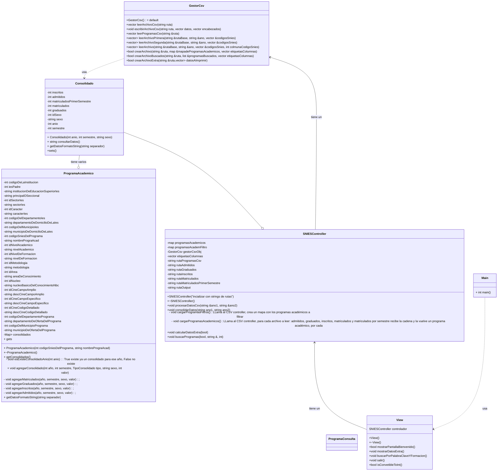

# Manual Técnico – SNIES_EXTRACTOR 
## Gracias a quienes me prestaron este proyecto :)

## Presentación general  
En este proyecto se utilizarán 5 clases para cumplir el propósito de extraer la información del Sistema Nacional de Información de Educación Superior. Para el usuario, este tendrá una interfaz por terminal que le indicará los pasos a seguir y la información que necesita digitar.

## Cumplimiento de Requerimientos  

1. **Solicitar rango de años a analizar**  
   En el menú, se le pregunta al usuario cuál es el primer año de búsqueda, tomando en cuenta que los rangos de años siempre son consecutivos, el segundo año de búsqueda se calcula a partir del primero.

2. **Lectura de archivos .csv correspondientes**  
   A partir de los años ingresados por el usuario, el controlador (clase `SNIESController`) leerá la información de los archivos apropiados uno por uno.

3. **Calcular admitidos, inscritos, graduados, matriculados y matriculados de primer semestre por programa y por año**  
   El SNIES-Extractor, mediante su controlador, calculará estos datos por cada programa y año a partir de los datos en bruto que extrae de los archivos .csv apropiados.

4. **Generación de Archivos de Salida**  
   Al terminar de extraer la información y procesarla, el SNIES-Extractor generará un archivo de resultados en la siguiente carpeta que ya debería estar parametrizada en el disco duro:  
   `C:\SNIES_EXTRACTOR\outputs\resultados.csv`.

5. **Visualización de Datos**  
   El SNIES-Extractor muestra al usuario el consolidado de estudiantes por año en programas presenciales o virtuales, la diferencia porcentual anual entre la cantidad de nuevos matriculados durante los años de búsqueda por programa y la lista de programas sin nuevos matriculados en 3 semestres consecutivos. Además, permitirá al usuario exportar esta información en un archivo ubicado en la carpeta ya parametrizada:  
   `C:\SNIES_EXTRACTOR\outputs\extras.csv`.

6. **Filtrado de Programas**  
   Se le pregunta al usuario si desea hacer una búsqueda con 2 filtros entre los programas solicitados: una palabra clave para buscar según los nombres de programas y el nivel de formación de los programas.

7. **Validación de Datos**  
   El SNIES-Extractor es un programa de C++ robusto que puede detectar errores a la hora de recibir información fuera de rangos esperados, tanto de parte del usuario como de la lectura de los archivos .csv.

Más abajo podrán encontrar el diagrama UML de las clases.

# Diagrama Mermaid

*El vector de Consolidados tendrá siempre 8 posiciones [0-7] donde:*
*vector[0] es primer año, primer semestre, hombres*
*vector[1] es primer año, segundo semestre, hombres*
*vector[2] es primer año, primer semestre, mujeres*
*vector[3] es primer año, segundo semestre, mujeres*
*vector[4] es segundo año, primer semestre, hombres*
*vector[5] es segundo año, segundo semestre, hombres*
*vector[6] es segundo año, primer semestre, mujeres*
*vector[7] es segundo año, segundo semestre, mujeres*

## Lista de chequeo de código fuente

### Claridad y Estructura

- **Flujo Confuso**: El código no sigue un flujo lógico, haciendo difícil seguir la secuencia de operaciones.  
  _Ejemplo_: Funciones que realizan saltos abruptos entre tareas sin relación aparente.

- **Documentación Insuficiente o Ausente**: Falta de comentarios claros o documentación, especialmente en partes complicadas del código.  
  _Ejemplo_: Código con bucles y condicionales complejos sin explicaciones sobre su propósito.

- **Comentarios Superfluos o Desactualizados**: Comentarios que no aportan valor o que ya no son correctos, generando confusión.  
  _Ejemplo_: Comentarios que describen el código de manera obvia como `// incrementa i` en lugar de explicar la intención detrás de la lógica.

- **Comentarios Insuficientes en Métodos Complejos**: Métodos o funciones sin comentarios que describan sus parámetros, valores de retorno y excepciones que pueden ser lanzadas.  
  _Ejemplo_: Falta de `doxygen` u otro estilo de documentación en funciones clave o públicas de una clase.

- **Nombres de Variables No Descriptivos**: Uso de nombres genéricos o confusos que no reflejan la función o el contenido de la variable.  
  _Ejemplo_: Variables nombradas con una sola letra o nombres no intuitivos como `data1`, `xyz`.

- **Números Mágicos**: Uso de valores literales dispersosen el código en lugar de constantes con nombres descriptivos.  
  _Ejemplo_: Usar `3.14159` directamente en lugar de definir una constante como `const double PI = 3.14159;`.

- **Caminos No Cubiertos en Condicionales**: Verificación de que todas las ramas de los condicionales (como `else`) sean manejadas.  
  _Ejemplo_: Bloques `else` que no contienen código o condicionales con múltiples `if` sin un `else` final para manejar casos imprevistos.

- **Valores o Estados No Manejados**: Verificación de que todos los valores posibles de una variable sean cubiertos en condicionales o estructuras `switch`.  
  _Ejemplo_: Un `switch` en una enumeración que no tiene un `default` para cubrir casos imprevistos.

- **Métodos Relacionados No Agrupados**: Los métodos con lógica relacionada no están ubicados juntos, lo que dificulta la comprensión del flujo de trabajo o la relación entre ellos.  
  _Ejemplo_: Métodos de inicialización, validación, y procesamiento dispersos a lo largo de la clase en lugar de estar agrupados por funcionalidad.

- **Atributos y Variables Relacionadas No Agrupados**: Los atributos o variables que están conceptualmente relacionados no están agrupados, lo que reduce la claridad en cuanto a su función dentro de la clase.  
  _Ejemplo_: Variables que manejan información sobre un cliente (nombre, dirección, teléfono) no están juntas en la declaración, lo que hace más difícil entender su relación.

### Complejidad

- **Estructuras de Control Anidadas Profundamente**: Uso excesivo de bucles y condicionales anidados que complica la lectura.  
  _Ejemplo_: Tres o más niveles de bucles o condicionales dentro de una función.

- **Complejidad Ciclomática Alta**: Funciones o métodos que contienen demasiadas rutas posibles debido a condicionales, bucles o bifurcaciones excesivas, lo que aumenta la dificultad de prueba y mantenimiento.  
  _Ejemplo_: Una función con múltiples condicionales `if-else` o `switch` que dificulta entender el flujo lógico.

- **Falta de Estructura**: Sería beneficioso definir nuevos tipos de datos (o clases) para representar entidades complejas dentro del código.

### Cohesión y Organización

- **Baja Cohesión**: Módulos o funciones que tienen múltiples responsabilidades no relacionadas.  
  _Ejemplo_: Se pueden identificar secciones de código que podrían convertirse en funciones o módulos independientes.

- **Baja Cohesión en Clases**: Una clase debe tener una única responsabilidad bien definida. Si una clase maneja varias responsabilidades o tareas no relacionadas, esto indica baja cohesión.  
  _Ejemplo_: Una clase que gestiona tanto la lógica de negocio como el acceso a la base de datos, violando el **Principio de Responsabilidad Única (SRP)**. Se recomienda dividirla en clases más especializadas. Clases con más de 200-300 líneas pueden indicar que tienen múltiples responsabilidades y deben ser divididas

**Métodos con Demasiadas Responsabilidades**: Métodos que realizan múltiples tareas no relacionadas deben ser refactorizados. Cada método debe hacer solo una cosa.  
  _Ejemplo_: Un método que valida datos, calcula resultados y actualiza una interfaz gráfica. Este método podría dividirse en tres métodos con responsabilidades claras. Métodos de más de 20-30 líneas pueden ser demasiado complejos y necesitar dividirse en submétodos.

- **Falta de Encapsulamiento**: Las clases y métodos deben ocultar sus detalles internos y exponer solo lo necesario a otros objetos.  
  _Ejemplo_: Campos de clase expuestos directamente (sin uso de métodos `getters` o `setters`), acceso directo a variables internas desde fuera de la clase, métodos definidos como públicos cuando deberían ser realmente privados

### Acoplamiento y Dependencias

- **Alto Acoplamiento**: Cambios en una parte del código requieren ajustes frecuentes en otras partes.  
  _Ejemplo_: Modificar una estructura de datos que requiere cambios en múltiples funciones que dependen directamente de esa estructura.

-  **Violación de la Ley de Demeter (Principio de Mínimo Conocimiento)**: Las clases deben interactuar solo con objetos que conocen directamente, y no a través de intermediarios.  
  _Ejemplo_: En lugar de realizar llamadas en cadena como `a.getB().getC().doSomething()`, la clase `a` debería delegar la tarea, asegurando que no dependa de la estructura interna de `b` o `c`.

### Mantenibilidad y Escalabilidad

- **Dificultad de Extensión**: Es difícil añadir nuevas características debido a la estructura actual del código.  
  _Ejemplo_: Código tan rígido que cualquier nueva funcionalidad requiere una reescritura significativa.

- **Pruebas Complicadas**: Estructura de código que hace difícil escribir y mantener pruebas.  
  _Ejemplo_: Funciones con alto acoplamiento y dependencias externas complejas que requieren configuraciones extensas para pruebas.

- **Diseño Orientado a Objetos**: Podría un diseño orientado a objetos mejorar la escalabilidad y la flexibilidad para futuros cambios.

### Separación de Intereses

- **Mezcla de Lógica de Negocio y Presentación**: Lógica de negocio y operaciones de I/O o escritura en consola entrelazadas en el mismo bloque de código.  
  _Ejemplo_: Código que calcula resultados y al mismo tiempo actualiza una interfaz gráfica.

### Documentación y Estilo de Código

- **Inconsistencia en el Estilo de Código**: No sigue un estilo de codificación consistente que cumpla con las guías de estilo de C++ 
  _Ejemplo_: Mezcla de estilos de nombre_variable para variables cuando se debe usar el estilo de camelCase.

- **Documentación Insuficiente**: Falta de comentarios y documentación adecuada en clases y métodos.  
  _Ejemplo_: Clases complejas sin comentarios explicativos sobre su propósito y funcionamiento.

### Código Duplicado

- **Múltiples Bloques de Código con Lógica Similar**: Se encuentran bloques de código repetidos o con lógica muy similar en diferentes partes del programa, lo que sugiere que podrían ser abstraídos en una función o método reutilizable.  
  _Ejemplo_: Dos o más funciones realizan el mismo tipo de procesamiento sobre datos pero con ligeras variaciones en los parámetros.

- **Condicionales Repetidos en Múltiples Lugares**: El mismo bloque condicional (`if-else`, `switch`) aparece en diferentes métodos o clases, sugiriendo que dicha lógica podría encapsularse en una función o clase.  
  _Ejemplo_: El mismo bloque `if-else` se repite en varias clases para verificar el estado de un objeto o variable.

- **Falta de Abstracción en Funcionalidades Comunes**: Código común o general no ha sido abstraído en una función o clase reutilizable, lo que lleva a la repetición de lógica en distintas partes del sistema.  
  _Ejemplo_: Operaciones comunes como la validación de fechas, cálculos de impuestos, o filtros de datos que se repiten sin estar encapsulados en un módulo reutilizable.

- **Fragmentos Repetidos en Bucles o Iteraciones**: El mismo fragmento de código aparece repetido en varias iteraciones de un bucle, en lugar de abstraerse en una función.  
  _Ejemplo_: El mismo conjunto de operaciones se repite dentro de varios bucles `for` o `while`.

- **Duplicación en Validaciones o Filtros**: Validaciones o filtros de datos se repiten en distintas funciones o clases, sugiriendo que podrían unificarse en un método o clase de utilidad compartida.  
  _Ejemplo_: La misma validación de un campo de entrada se realiza en varios métodos o controladores.

- **Duplicación en Inicialización de Objetos o Variables**: La inicialización de objetos o variables se repite en múltiples lugares en lugar de centralizarse en un método de fábrica o constructor común.  
  _Ejemplo_: Se repite la creación de un objeto `Cliente` con los mismos valores predeterminados en varias partes del código.
