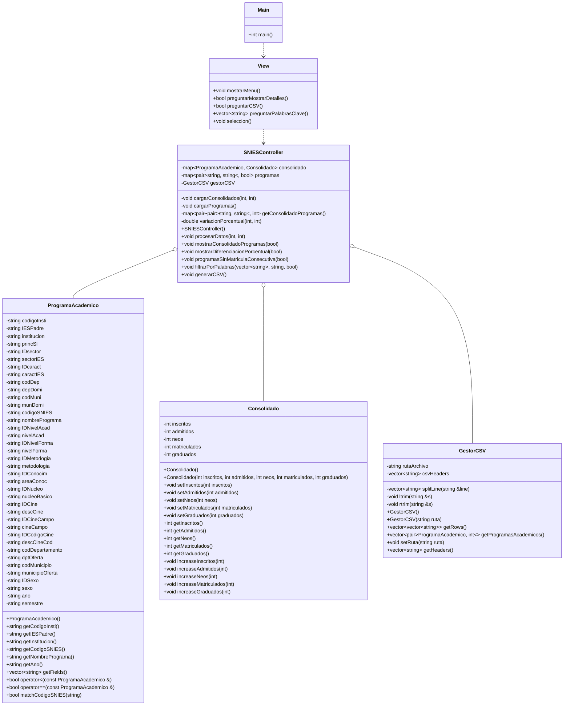
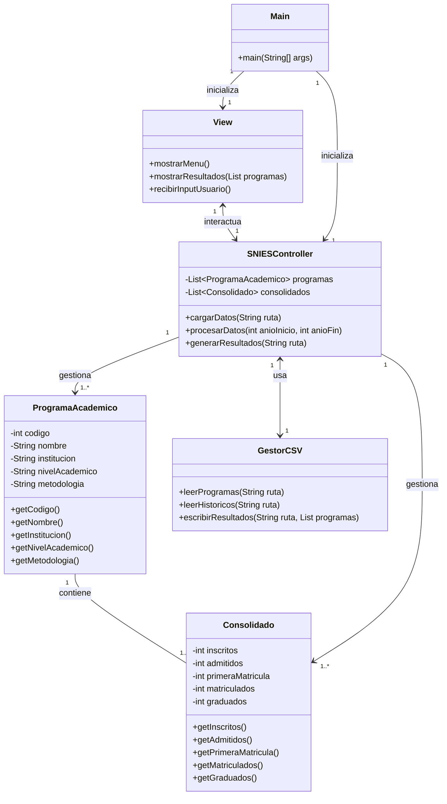
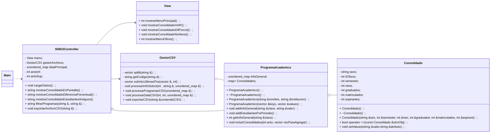
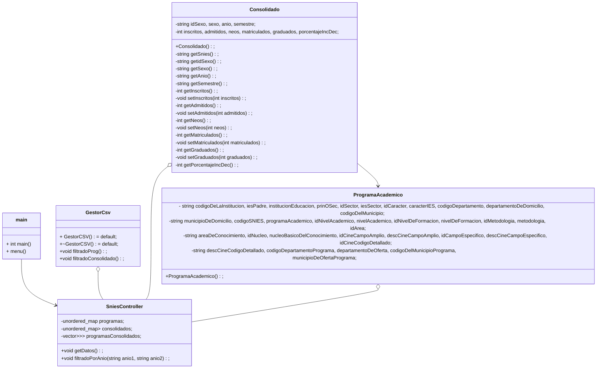
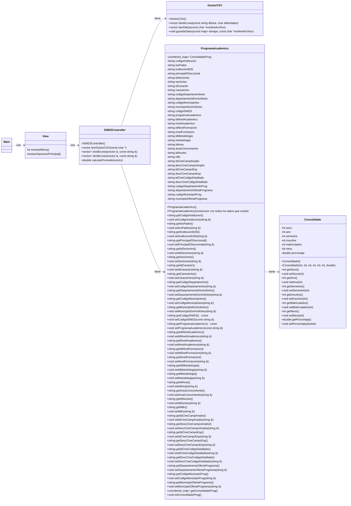
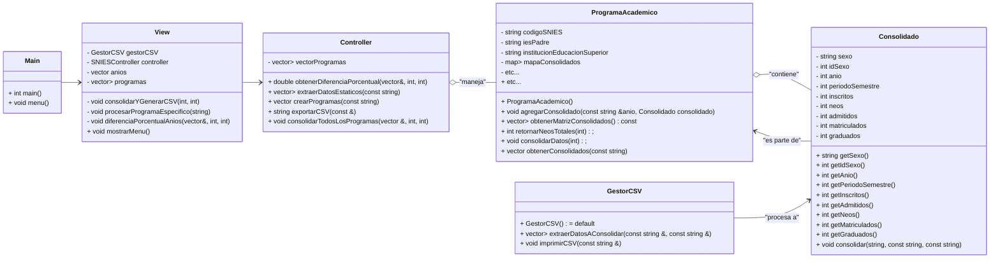

### Diseño 1

```mermaid
classDiagram
    Main ..> View
    View ..> SNIESController
    SNIESController o-- ProgramaAcademico
    SNIESController o-- Consolidado
    SNIESController o-- GestorCSV

    class Main {
        +int main()
    }

    class View {
        +void mostrarMenu()
        +bool preguntarMostrarDetalles()
        +bool preguntarCSV()
        +vector~string~ preguntarPalabrasClave()
        +void seleccion()
    }

    class SNIESController {
        -map~ProgramaAcademico, Consolidado~ consolidado
        -map~pair~string, string~, bool~ programas
        -GestorCSV gestorCSV
        -void cargarConsolidados(int, int)
        -void cargarProgramas()
        -map~pair~pair~string, string~, string~, int~ getConsolidadoProgramas()
        -double variacionPorcentual(int, int)
        +SNIESController()
        +void procesarDatos(int, int)
        +void mostrarConsolidadoProgramas(bool)
        +void mostrarDiferenciacionPorcentual(bool)
        +void programasSinMatriculaConsecutiva(bool)
        +void filtrarPorPalabras(vector~string~, string, bool)
        +void generarCSV()
    }

    class ProgramaAcademico {
        -string codigoInsti
        -string IESPadre
        -string institucion
        -string princSl
        -string IDsector
        -string sectorIES
        -string IDcaract
        -string caractIES
        -string codDep
        -string depDomi
        -string codMuni
        -string munDomi
        -string codigoSNIES
        -string nombrePrograma
        -string IDNivelAcad
        -string nivelAcad
        -string IDNivelForma
        -string nivelForma
        -string IDMetodogia
        -string metodologia
        -string IDConocim
        -string areaConoc
        -string IDNucleo
        -string nucleoBasico
        -string IDCine
        -string descCine
        -string IDCineCampo
        -string cineCampo
        -string IDCodigoCine
        -string descCineCod
        -string codDepartamento
        -string dptOferta
        -string codMunicipio
        -string municipioOferta
        -string IDSexo
        -string sexo
        -string ano
        -string semestre
        +ProgramaAcademico()
        +string getCodigoInsti()
        +string getIESPadre()
        +string getInstitucion()
        +string getCodigoSNIES()
        +string getNombrePrograma()
        +string getAno()
        +vector~string~ getFields()
        +bool operator<(const ProgramaAcademico &)
        +bool operator==(const ProgramaAcademico &)
        +bool matchCodigoSNIES(string)
    }

    class Consolidado {
        -int inscritos
        -int admitidos
        -int neos
        -int matriculados
        -int graduados
        +Consolidado()
        +Consolidado(int inscritos, int admitidos, int neos, int matriculados, int graduados)
        +void setInscritos(int inscritos)
        +void setAdmitidos(int admitidos)
        +void setNeos(int neos)
        +void setMatriculados(int matriculados)
        +void setGraduados(int graduados)
        +int getInscritos()
        +int getAdmitidos()
        +int getNeos()
        +int getMatriculados()
        +int getGraduados()
        +void increaseInscritos(int)
        +void increaseAdmitidos(int)
        +void increaseNeos(int)
        +void increaseMatriculados(int)
        +void increaseGraduados(int)
    }

    class GestorCSV {
        -string rutaArchivo
        -vector~string~ csvHeaders
        -vector~string~ splitLine(string &line)
        -void ltrim(string &s)
        -void rtrim(string &s)
        +GestorCSV()
        +GestorCSV(string ruta)
        +vector~vector~string~~ getRows()
        +vector~pair~ProgramaAcademico, int~~ getProgramasAcademicos()
        +void setRuta(string ruta)
        +vector~string~ getHeaders()
    }

```

###  Diseño 2

```mermaid
classDiagram
direction BT
    class ProgramaAcademico {
        -int codigoDeLaInstitucion
        -int iesPadre
        -string institucionDeEducacionSuperiorIes
        -string principalOSeccional
        -int idSectorIes
        -string sectorIes
        -int idCaracter
        -string caracterIes
        -int codigoDelDepartamentoIes
        -string departamentoDeDomicilioDeLaIes
        -int codigoDelMunicipioIes
        -string municipioDeDomicilioDeLaIes
        -int codigoSniesDelPrograma
        -string programaAcademico
        -int idNivelAcademico
        -string nivelAcademico
        -int idNivelDeFormacion
        -string nivelDeFormacion
        -int idMetodologia
        -string metodologia
        -int idArea
        -string areaDeConocimiento
        -int idNucleo
        -string nucleoBasicoDelConocimientoNbc
        -int idCineCampoAmplio
        -string descCineCampoAmplio
        -int idCineCampoEspecifico
        -string descCineCampoEspecifico
        -int idCineCodigoDetallado
        -string descCineCodigoDetallado
        -int codigoDelDepartamentoPrograma
        -string departamentoDeOfertaDelPrograma
        -int codigoDelMunicipioPrograma
        -string municipioDeOfertaDelPrograma
        -Vector<Consolidado*> consolidados
        +ProgramaAcademico()
        +~ProgramaAcademico()
        +setCodigoDeLaInstitucion(int)
        +setIesPadre(int)
        +setInstitucionDeEducacionSuperiorIes(string)
        +setPrincipalOSeccional(string)
        +setIdSectorIes(int)
        +setSectorIes(string)
        +setIdCaracter(int)
        +setCaracterIes(string)
        +setCodigoDelDepartamentoIes(int)
        +setDepartamentoDeDomicilioDeLaIes(string)
        +setCodigoDelMunicipioIes(int)
        +setMunicipioDeDomicilioDeLaIes(string)
        +setCodigoSniesDelPrograma(int)
        +setProgramaAcademico(string)
        +setIdNivelAcademico(int)
        +setNivelAcademico(string)
        +setIdNivelDeFormacion(int)
        +setNivelDeFormacion(string)
        +setIdMetodologia(int)
        +setMetodologia(string)
        +setIdArea(int)
        +setAreaDeConocimiento(string)
        +setIdNucleo(int)
        +setNucleoBasicoDelConocimientoNbc(string)
        +setIdCineCampoAmplio(int)
        +setDescCineCampoAmplio(string)
        +setIdCineCampoEspecifico(int)
        +setDescCineCampoEspecifico(string)
        +setIdCineCodigoDetallado(int)
        +setDescCineCodigoDetallado(string)
        +setCodigoDelDepartamentoPrograma(int)
        +setDepartamentoDeOfertaDelPrograma(string)
        +setCodigoDelMunicipioPrograma(int)
        +setMunicipioDeOfertaDelPrograma(string)
        +getCodigoDeLaInstitucion()
        +getIesPadre()
        +getInstitucionDeEducacionSuperiorIes()
        +getPrincipalOSeccional()
        +getIdSectorIes()
        +getSectorIes()
        +getIdCaracter()
        +getCaracterIes()
        +getCodigoDelDepartamentoIes()
        +getDepartamentoDeDomicilioDeLaIes()
        +getCodigoDelMunicipioIes()
        +getMunicipioDeDomicilioDeLaIes()
        +getCodigoSniesDelPrograma()
        +getProgramaAcademico()
        +getIdNivelAcademico()
        +getNivelAcademico()
        +getIdNivelDeFormacion()
        +getNivelDeFormacion()
        +getIdMetodologia()
        +getMetodologia()
        +getIdArea()
        +getAreaDeConocimiento()
        +getIdNucleo()
        +getNucleoBasicoDelConocimientoNbc()
        +getIdCineCampoAmplio()
        +getDescCineCampoAmplio()
        +getIdCineCampoEspecifico()
        +getDescCineCampoEspecifico()
        +getIdCineCodigoDetallado()
        +getDescCineCodigoDetallado()
        +getCodigoDelDepartamentoPrograma()
        +getDepartamentoDeOfertaDelPrograma()
        +getCodigoDelMunicipioPrograma()
        +getMunicipioDeOfertaDelPrograma()
        +pushConsolidado(Consolidado*)
        +getConsolidado()
    }
    class Consolidado {
        -int inscritos
        -int admitidos
        -int matriculadosPrimerSemestre
        -int matriculados
        -int graduados
        -int idSexo
        -string sexo
        -int ano
        -int semestre
        +setIdSexo(int)
        +setSexo(string)
        +setAno(int)
        +setSemestre(int)
        +getIdSexo()
        +getSexo()
        +getAno()
        +getSemestre()
        +setInscritos(int)
        +setAdmitidos(int)
        +setMatriculadosPrimerSemestre(int)
        +setMatriculados(int)
        +setGraduados(int)
        +getInscritos()
        +getAdmitidos()
        +getMatriculadosPrimerSemestre()
        +getMatriculados()
        +getGraduados()
    }
    class GestorCsv {
        +GestorCsv() = default
        +vector<int> leerProgramasCsv(string &ruta)
        +vector<vector<string>> leerArchivoPrimera(string &rutaBase, string &ano, vector<int> &codigosSnies)
        +vector<vector<string>> leerArchivoSegunda(string &rutaBase, string &ano, vector<int> &codigosSnies)
        +vector<vector<string>> leerArchivo(string &rutaBase, string &ano, vector<int> &codigosSnies, int colmunaCodigoSnies)
        +bool crearArchivo(string &ruta, map <int, ProgramaAcademico*> &mapadeProgramasAcademicos, vector<string> etiquetasColumnas)
        +bool crearArchivoBuscados(string &ruta, list<ProgramaAcademico*> &programasBuscados, vector<string> etiquetasColumnas)
        +bool crearArchivoExtra(string &ruta,vector<vector<string>> datosAImprimir)
    }
    class SNIESController {
        -map <int, ProgramaAcademico*> programasAcademicos
        -GestorCsv gestorCsvObj
        -vector<string> etiquetasColumnas
        -string rutaProgramasCsv
        -string rutaAdmitidos
        -string rutaGraduados
        -string rutaInscritos
        -string rutaMatriculados
        -string rutaMatriculadosPrimerSemestre
        -string rutaOutput
        +SNIESController("incializar con strings de rutas")
        +~SNIESController()
        +void procesarDatosCsv(string &ano1, string &ano2)
        +void calcularDatosExtra(bool)
        +void buscarProgramas(bool, string &, int)
    }
    class View {
        SNIESController controlador
        +View()
        +~View()
        +bool pantallaBienvenido()
        +void visualizacionDatosExtra()
        +void buscarPorPalabraClaveYFormacion()
        +void salir()
        +bool isConvetibleToInt()
    }
    class Main {
        + int main()
    }

ProgramaAcademico o-- Consolidado : tiene varios
View <.. Main : usa
View --> SNIESController : tiene un
SNIESController --> GestorCsv: tiene un
SNIESController o-- Consolidado
Consolidado <.. GestorCsv: usa
```

### Diseño 3

```mermaid
classDiagram
    class ProgramaAcademico {
        -int codigo
        -String nombre
        -String institucion
        -String nivelAcademico
        -String metodologia
        +getCodigo()
        +getNombre()
        +getInstitucion()
        +getNivelAcademico()
        +getMetodologia()
    }

    class Consolidado {
        -int inscritos
        -int admitidos
        -int primeraMatricula
        -int matriculados
        -int graduados
        +getInscritos()
        +getAdmitidos()
        +getPrimeraMatricula()
        +getMatriculados()
        +getGraduados()
    }

    class GestorCSV {
        +leerProgramas(String ruta)
        +leerHistoricos(String ruta)
        +escribirResultados(String ruta, List<ProgramaAcademico> programas)
    }

    class SNIESController {
        -List~ProgramaAcademico~ programas
        -List~Consolidado~ consolidados
        +cargarDatos(String ruta)
        +procesarDatos(int anioInicio, int anioFin)
        +generarResultados(String ruta)
    }

    class View {
        +mostrarMenu()
        +mostrarResultados(List<ProgramaAcademico> programas)
        +recibirInputUsuario()
    }

    class Main {
        +main(String[] args)
    }

    ProgramaAcademico "1" -- "1..*" Consolidado : contiene
    SNIESController "1" <--> "1" GestorCSV : usa
    SNIESController "1" --> "1..*" ProgramaAcademico : gestiona
    SNIESController "1" --> "1..*" Consolidado : gestiona
    View "1" <--> "1" SNIESController : interactua
    Main "1" --> "1" SNIESController : inicializa
    Main "1" --> "1" View : inicializa

```

### Diseño 4

```mermaid
classDiagram
direction LR
    class View{
        + int mostrarMenuPrincipal();        
        + void mostrarConsolidadoVirtP();     
        + void mostrarConsolidadoDifPorcnt(); 
        + void mostrarConsolidadoNoNeos();    
        + int mostrarMenuFiltros();
    }
    class GestorCSV{
        - vector<string> splitt(string &);
        - string getCodigo(string &);
        - vector<string> subVecUltimasPos(vector<string> &, int);
        - void procesarInfoSelect(int , string &, unordered_map<string, ProgramaAcademico> &);
        + void procesarProgramasCSV(unordered_map<string, ProgramaAcademico> &);
        + void procesarDataCSV(int, int, unordered_map<string, ProgramaAcademico> &);
        + void exportarCSV(string &contenidoCSV);

    }
    class SNIESController{
        - View menu;
        - GestorCSV gestorArchivos;
        - unordered_map<string, ProgramaAcademico> dataPrincipal;
        - int anioInf;
        - int anioSup;
        + void cargarDatos();
        + string mostrarConsolidadoEnPantalla();           
        + string mostrarConsolidadoDiferenciaPorcentual(); 
        + string mostrarConsolidadoEstudiantesAntiguos()   
        + string filtrarProgramas(string &, string &);
        + void exportarArchivoCSV(string &);
    }
    class ProgramaAcademico{
        - unordered_map<string, string> infoGeneral;
        - map<int, vector<Consolidado>> Consolidados;
        + ProgramaAcademico();
        + ~ProgramaAcademico();
        + ProgramaAcademico(string &nombre, string &institucion ); 
        + ProgramaAcademico(vector<string> &keys, vector<string> &values);
        + void addInfoGeneral(string &clave, string &valor);
        + void addEstudiantesPorPeriodo();
        + int getInfoGeneral(string &clave);
        + void incluirConsolidados(int anio, vector<Consolidado> vecParaAgregar);
    }

    class Consolidado{
        - string sexo;
        - int IDSexo;
        - int semestre;
        - int neos;
        - int graduados;
        - int matriculados;
        - int aspirantes;
        + Consolidado();
        + ~Consolidado();
        + Consolidado(string &sex, int &semester, int &neo, int &graduated, int &matriculados, int &aspirant);
        + bool operator ==(const Consolidado &otroObj);
        + void setValues(string &valor,string &atributo);
        
        
    }

    GestorCSV o-- ProgramaAcademico
    SNIESController --> View
    SNIESController --> GestorCSV
    SNIESController o-- ProgramaAcademico
    ProgramaAcademico o-- Consolidado
    Main ..> SNIESController
```

### Diagrama 5

```mermaid
classDiagram
    class ProgramaAcademico{
        - string codigoDeLaInstitucion, iesPadre, institucionEducacion, prinOSec, idSector, iesSector, idCaracter, caracterIES, codigoDepartamento, departamentoDeDomicilio, codigoDelMunicipio;
        -string municipioDeDomicilio, codigoSNIES, programaAcademico, idNivelAcademico, nivelAcademico, idNivelDeFormacion, nivelDeFormacion, idMetodologia, metodologia, idArea;
        -string areaDeConocimiento, idNucleo, nucleoBasicoDelConocimiento, idCineCampoAmplio, descCineCampoAmplio, idCampoEspecifico, descCineCampoEspecifico, idCineCodigoDetallado;
        -string descCineCodigoDetallado, codigoDepartamentoPrograma, departamentoDeOferta, codigoDelMunicipioPrograma, municipioDeOfertaPrograma;
        +ProgramaAcademico();
    }
    class Consolidado{
        -string idSexo, sexo, anio, semestre;
        -int inscritos, admitidos, neos, matriculados, graduados, porcentajeIncDec;
        +Consolidado();
        -string getSnies();
        -string getidSexo();
        -string getSexo();
        -string getAnio();
        -string getSemestre();
        -int getInscritos();
        -void setInscritos(int inscritos);
        -int getAdmitidos();
        -void setAdmitidos(int admitidos);
        -int getNeos();
        -void setNeos(int neos);
        -int getMatriculados();
        -void setMatriculados(int matriculados);
        -int getGraduados();
        -void setGraduados(int graduados);
        -int getPorcentajeIncDec();
    }
    class GestorCsv{
        + GestorCSV() = default;
        +~GestorCSV() = default;
        +void filtradoProg();
        +void filtradoConsolidado();
    }
    class SniesController{
        -unordered_map<string, ProgramaAcademico> programas;
        -unordered_map<string, unordered_map<string, Consolidado>> consolidados;
        -vector<pair<ProgramaAcademico, unordered_map<string, vector<Consolidado>>>> programasConsolidados;
        +void getDatos();
        +void filtradoPorAnio(string anio1, string anio2);

    }
    class main{
        + int main()
        + menu()
    }

main -->SniesController
GestorCsv o-- SniesController
Consolidado o-- SniesController
ProgramaAcademico o-- SniesController
Consolidado --> ProgramaAcademico

```

### Diagrama 6

```mermaid

classDiagram

direction LR

class View{
    int mostrarMenu()
    mostrarOpcionesPrincipal()
}

class Consolidado{

    -int sexo
    -int ano
    -int semestre
    -int inscritos
    -int matriculados
    -int neos
    -double porcentaje

    +Consolidado()
    +Consolidado(int, int, int, int, int, int, double)
    +int getSexo()
    +void setSexo(int)
    +int getAno()
    +void setAno(int)
    +int getSemestre()
    +void setSemestre(int)
    +int getInscritos()
    +void setInscritos(int)
    +int getMatriculados()
    +void setMatriculados(int)
    +int getNeos()
    +void setNeos(int)
    +double getPorcentaje()
    +void setPorcentaje(double)


}

class GestorCSV{
    +GestorCSV()
    +vector<string> dividirLinea(const string &linea, char delimitador)
    +vector<string> leerDatos(const char *nombreArchivo)
    +void guardarDatos(const map<int, vector<string>> &mapa, const char *nombreArchivo)
}

class ProgramaAcademico{

    -unordered_map<int, vector<Consolidado *>> ConsolidadoProg
    -string codigoInstitucion
    -string iesPadre
    -string institucionEdS
    -string principalOSeccional
    -string idSectorIes
    -string sectorIes
    -string idCaracter
    -string caracterIes
    -string codigoDepartamentoIes
    -string departamentoDomicilioIes
    -string codigoMunicipioIes
    -string municipioDomicilioIes
    -string codigoSNIES
    -string programaAcademico
    -string idNivelAcademico
    -string nivelAcademico
    -string idNivelFormacion
    -string nivelFormacion
    -string idMetodologia
    -string metodologia
    -string idArea
    -string areaConocimiento
    -string idNucleo
    -string nBc
    -string idCineCampAmplio
    -string descCineCampoAmplio
    -string idCineCampoEsp
    -string descCineCampoEsp
    -string idCineCodigoDetallado
    -string descCineCodigoDetallado
    -string codigoDepartamentoProg
    -string departamentoOfertaPrograma
    -string codigoMunicipioProg
    -string municipioOfertaPrograma

    +ProgramaAcademico()
    +ProgramaAcademico(constructor con todos los datos que recibe)

     +string getCodigoInstitucion()
     +void setCodigoInstitucion(string &)
     +string getIesPadre()
     +void setIesPadre(string &)
     +string getInstitucionEdS()
     +void setInstitucionEdS(string &)
     +string getPrincipalOSeccional()
     +void setPrincipalOSeccional(string &)
     +string getIdSectorIes()
     +void setIdSectorIes(string &)
     +string getSectorIes()
     +void setSectorIes(string &)
     +string getIdCaracter()
     +void setIdCaracter(string &)
     +string getCaracterIes()
     +void setCaracterIes(string &)
     +string getCodigoDepartamento()
     +void setCodigoDepartamento(string &)
     +string getDepartamentoDomicilioIes()
     +void setDepartamentoDomicilioIes(string &)
     +string getCodigoMunicipioIes()
     +void setCodigoMunicipioIes(string &)
     +string getMunicipioDomicilioIes()
     +void setMunicipioDomicilioIes(string &)
     +string getCodigoSNIES() const
     +void setCodigoSNIES(const string &)
     +string getProgramaAcademico() const
     +void setProgramaAcademico(const string &)
     +string getIdNivelAcademico()
     +void setIdNivelAcademico(string &)
     +string getNivelAcademico()
     +void setNivelAcademico(string &)
     +string getIdNivelFormacion()
     +void setIdNivelFormacion(string &)
     +string getNivelFormacion()
     +void setNivelFormacion(string &)
     +string getIdMetodologia()
     +void setIdMetodologia(string &)
     +string getMetodologia()
     +void setMetodologia(string &)
     +string getIdArea()
     +void setIdArea(string &)
     +string getAreaConocimiento()
     +void setAreaConocimiento(string &)
     +string getIdNucleo()
     +void setIdNucleo(string &)
     +string getNBc()
     +void setNBc(string &)
     +string getIdCineCampAmplio()
     +void setIdCineCampAmplio(string &)
     +string getDescCineCampoAmplio()
     +void setDescCineCampoAmplio(string &)
     +string getIdCineCampoEsp()
     +void setIdCineCampoEsp(string &)
     +string getDescCineCampoEsp()
     +void setDescCineCampoEsp(string &)
     +string getIdCineCodigoDetallado()
     +void setIdCineCodigoDetallado(string &)
     +string getDescCineCodigoDetallado()
     +void setDescCineCodigoDetallado(string &)
     +string getDepartamentoOfertaPrograma()
     +void setDepartamentoOfertaPrograma(string &)
     +string getCodigoMunicipioProg()
     +void setCodigoMunicipioProg(string &)
     +string getMunicipioOfertaPrograma()
     +void setMunicipioOfertaPrograma(string &)
     +unordered_map<int, vector<Consolidado *>> getConsolidadoProg()
     +void setConsolidadoProg()

}

class SNIESController{

    +SNIESController()
    +vector<string> leerGestorCSV(const char *)
    +vector<vector<string>> dividirLinea(vector<string> &, const string &)
    +vector<vector<string>> dividirLinea(vector<string> &, const string &)
    +double calcularPromedio(vector<double>)
}

Main ..> View:usa
View ..> SNIESController:usa
SNIESController --> GestorCSV:tiene
SNIESController --> ProgramaAcademico:tiene
ProgramaAcademico --> Consolidado:tiene

```

### Diagrama 7

```mermaid
classDiagram
direction LR

 class View {
        - GestorCSV gestorCSV
        - SNIESController controller
        - vector<int> anios
        - vector<vector<ProgramaAcademico>> programas
        - void consolidarYGenerarCSV(int, int)
        - void procesarProgramaEspecifico(string)
        - void diferenciaPorcentualAnios(vector<ProgramaAcademico>&, int, int)
  

        + void mostrarMenu()

    }

    class Consolidado {
        - string sexo
        - int idSexo
        - int anio
        - int periodoSemestre
        - int inscritos
        - int neos
        - int admitidos
        - int matriculados
        - int graduados

        + string getSexo()
        + int getIdSexo()
        + int getAnio()
        + int getPeriodoSemestre()
        + int getInscritos()
        + int getAdmitidos()
        + int getNeos()
        + int getMatriculados()
        + int getGraduados()
        + void consolidar(string, const string, const string)
    }

    class Controller {
        - vector<vector<ProgramaAcademico>> vectorProgramas

        + double obtenerDiferenciaPorcentual(vector<ProgramaAcademico>&, int, int)
        + vector<vector<string>> extraerDatosEstaticos(const string)
        + vector<ProgramaAcademico> crearProgramas(const string)
        + string exportarCSV (const <ProgramaAcademico> &)
        + void consolidarTodosLosProgramas (vector<ProgramaAcademico> &, int, int)
    }

    class ProgramaAcademico {
        - string codigoSNIES
        - string iesPadre
        - string institucionEducacionSuperior
        - map<string, vector<Consolidado>> mapaConsolidados
        - etc...


        + ProgramaAcademico()
        + void agregarConsolidado(const string &anio, Consolidado consolidado)
        + vector<vector<string>> obtenerMatrizConsolidados() const
        + int retornarNeosTotales(int);
        + void consolidarDatos (int);
        + vector<Consolidado*> obtenerConsolidados(const string)
        + etc...
    }

    class GestorCSV {
        + GestorCSV() = default
        + vector<vector<string>> extraerDatosAConsolidar(const string &, const string &)
        + void imprimirCSV(const string &)
    }

    class Main {
        + int main()
        + void menu()
    }

    ProgramaAcademico o-- Consolidado : "contiene"
    Controller o-- ProgramaAcademico : "maneja"
    GestorCSV --> Consolidado : "procesa a"
    Consolidado --> ProgramaAcademico : "es parte de"
    Main --> View
    View --> Controller

```